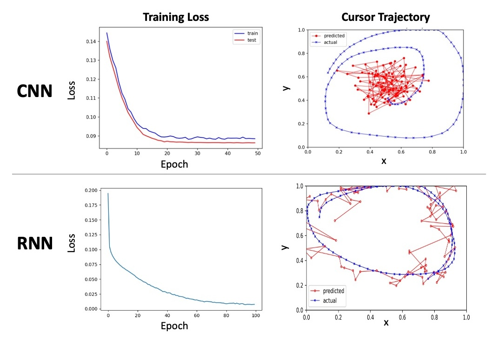

# Unlocking the Mind: Decoding Motor Intentions for Brain-Computer Interfaces

## Abstract
Brain activity can be decoded to develop brain-computer interface (BCI) devices, enabling non-muscular communication with control systems for individuals with disabilities. In this project, we utilized deep learning models to predict cursor coordinates on a screen using electrocorticographic (ECoG) signals. ECoG recordings were collected from 5 subjects as they manipulated a joystick to trace a target circle on a screen, within recording windows ranging from 12 to 36 minutes (G. Schalk et al., 2007; G. Schalk et al., 2008). Our deep learning models demonstrated varying accuracies in predicting cursor locations, with the recurrent neural network achieving 54%, compared to the convolutional neural network at 1%. We aim to enhance predictive performance by refining model architectures, incorporating Long Short Term Memory (LSTM), and exploring attention-based frameworks.

Neuromatch Academy Deep Learning Course 
Agustinia_Tsam Project Group 1
Ananth Kandala, Jeff Kelly, Siddhartha Mitra, Yavuz Uzun, Yiting Chang

## Method
### Dataset 
ECoG recordings were obtained from 60 electrodes positioned across various cortical regions on the left hemisphere in 5 human subjects. The ECoG data were collected while the subjects manipulated a joystick to trace a target circle on a screen during recording sessions lasting between 12 to 36 minutes. The ECoG signals were sampled at a rate of 1000 Hz.

Dataset download: https://exhibits.stanford.edu/data/catalog/zk881ps0522

### Data preparation
We segmented the data using a slice window of 1000 ms with an overlapping window of 100 ms. The datasets were then divided into Train (80%), Validation (10%), and Test (10%) datasets.

### Convolutional neural network (CNN)
We employed the EEG Net framework, which utilizes a convolutional neural network-based approach for analyzing this time-series data. EEG Net consists of three convolutional layers, each with dropout implemented, and max-pooling incorporated in the last two layers. The output of the final convolutional layer is passed to a fully connected layer, which outputs the predicted (x, y) coordinates of the cursor. The network was trained using Mean Squared Error (MSE) as the objective function.

### Recurrent neural network (RNN)
The RNN model takes 60 inputs and consists of 3 hidden layers, each with a size of 256. Training for one hundred epochs with a learning rate of 0.00001 resulted in a final training loss of 0.0074.

### CNN vs RNN
If the disparity between the true and predicted cursor positions is less than 10% of the screen's length or width, it is deemed correct.

Here are the performance metrics:
Accuracy: RNN achieved 54%, outperforming CNN at 1%.
Number of parameters: 1000 for CNN, 345,090 for RNN.
Training time: Approximately 12 minutes for CNN (on CPU/GPU), and about 90 minutes for RNN (utilizing GPU).

## Reference
Schalk, G., et al. "Decoding two-dimensional movement trajectories using electrocorticographic signals in humans." Journal of Neural Engineering 4.3 (2007): 264. doi: 10.1088/1741-2560/4/3/012

Schalk, Gerwin, et al. "Two-dimensional movement control using electrocorticographic signals in humans." Journal of Neural Engineering 5.1 (2008): 75. doi: 10.1088/1741-2560/5/1/008

EEGNet
https://github.com/aliasvishnu/EEGNet

## Acknowledgement
I would like to express our gratitude to our mentors, Davide Valeriani and Annik Carson, as well as our TA, José Biurrun Manresa, for their invaluable guidance throughout this project. Additionally, we extend our thanks to the Neuromatch Academy for providing an excellent deep learning course.

Neuromatch Academy Deep Learning Course
https://deeplearning.neuromatch.io/tutorials/intro.html
